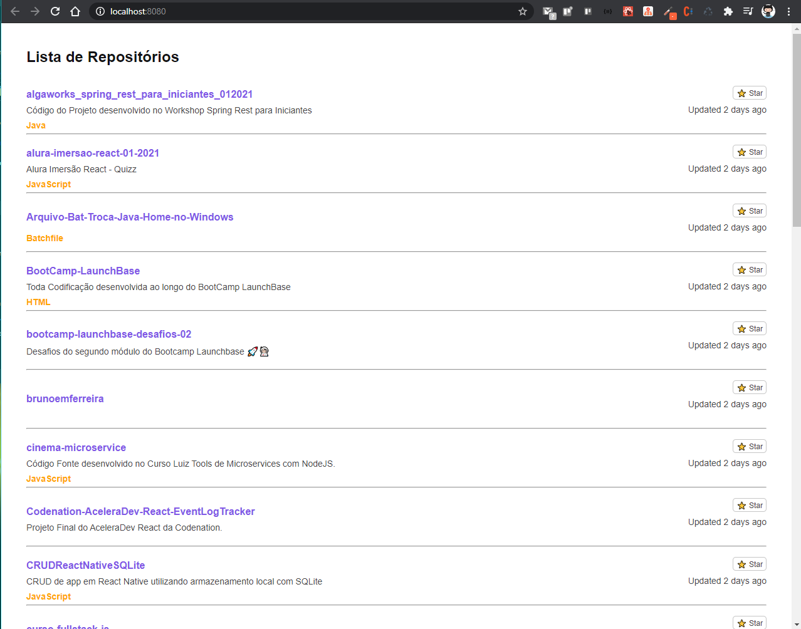

# RocketSeat Ignite React ( Chapter I ) - GitHubExplorer

<!-- ************************************* Baadges ********************************************* -->
<p align="center">
  
  
  
</p>

<p align="center">Curso Finalizado em : 13/03/2021</p>

## 🔥 Sobre o Projeto
Projeto desenvolvido nas aulas Iniciais do Ignite React onde consumimos a API de repositórios de um 
usuário do GitHub e carregamos a mesma na tela com suas informações Básicas, a estrutura do projeto foi montada toda manualmente configurando Babel, WebPack, WebPack Dev Server, Source Maps e Fast Refresh por fim migrando tudo que foi feito em JavaScript para TypeScript.

## 🧰 Tecnologias Utilizadas
* VSCode ( IDE )
* WebPack
* WebPack Dev Server
* SASS
* Source Maps
* Fast Refresh
* JavaScript
* React
* TypeScript

## 🖼️ Imagens do Projeto

<div align="center">



</div>


## ⚙️ Rodando o Projeto
```bash
# Clone este repositório
$ git clone https://github.com/brunoemferreira/rocketseat-ignite-react-01-github-explorer.git

# Baixar as bibliotecas utilizadas no projeto
$ yarn install
ou 
$ npm install

# Rodando o Projeto
$ yarn dev
ou 
$ npm dev

# O projeto ira Rodar
http://localhost:8080

```
⌨️ com ❤️ por [Bruno Eduardo](https://gist.github.com/brunoemferreira) 😊


